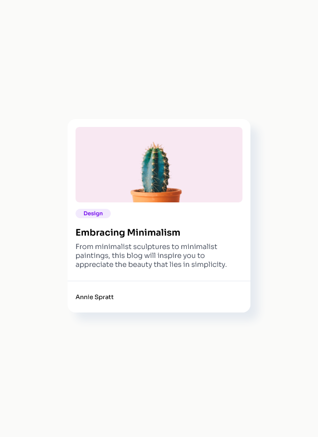

# minimal-blog-card

This is a project I made with HTML and CSS.

## Table of Content

- [Overview](#overview)
  - [Description](#description)
  - [Screenshot](#screenshot)
  - [Links](#links)
- [My process](#my-process)
  - [Built with](#built-with)
  - [What I learned](#what-i-learned)
  - [Continued Development](#continued-development)
  - [Useful Resources](#useful-resources)
- [Author](#author)
- [Acknowledgments](#acknowledgments)

## Overview

### Description

I present to you a small project I made. The objective was to make a minimal blog card, with an image, a title, a paragraph and an author name.
This project works on mobile, tablet and desktop computer !

### Screenshot



### Links

- [Live Site](https://sephydev.github.io/minimal-blog-card/)

## My process

### Built with

- Semantic HTML5
- CSS

### What I learned

Thanks to this project, I've practiced some semantic HTML and CSS. The following snippets are some examples of the knowledges I used.

- Semantic HTML5 (`<footer>`):

```html
<footer>
  <address rel="author">Annie Spratt</address>
</footer>
```

- CSS (`.card`):

```css
.card {
  background-color: #ffffff;
  width: 23rem;
  margin: 15rem auto;
  padding: 1rem 0;
  border-radius: 1rem;
  box-shadow: 1rem 1rem 1rem #e5eaf0;
}
```

### Continued Development

HTML and CSS are the base when creating a web project, I will continue to master those technologies on some future project.

### Useful Resources

- [Guide to HTML (W3School)](https://www.w3schools.com/html/default.asp)
- [Guide to CSS (W3School)](https://www.w3schools.com/css/default.asp)

## Author

- Website : Sephydev

## Acknowledgment

Thanks to my friends and my family for supporting me while I journey in the land of Web Development, and during the making of this project !
